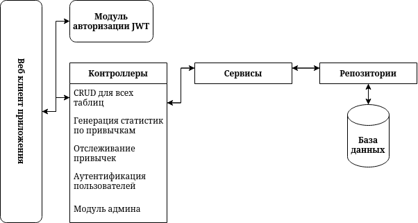
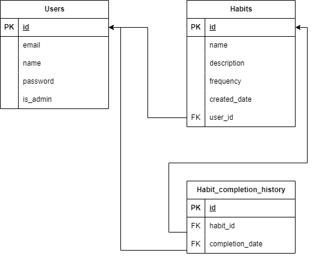

# Сервис для отслеживания привычек
## Описание проекта
Этот проект представляет собой разработку серверной части многопользовательского приложения для отслеживания привычек. 
Цель сервиса — предоставить пользователям возможность управлять своими привычками, отслеживать их выполнение и анализировать прогресс. 

### Основные технологии проекта
1. **Java 17**: Основной язык разработки.
2. **Spring Boot 3.2.0**: Фреймворк для упрощенной разработки серверных приложений. В проекте применяются модули Spring Boot:
   - `spring-boot-starter-web`: Создание REST API и работа с HTTP-запросами.
   - `spring-boot-starter-aop`: Поддержка аспектно-ориентированного программирования (AOP) для логирования и других аспектов.
   - `spring-boot-starter-jpa`: Подключение к базе данных с помощью JPA.
3. **Spring Security**: Фреймворк для аутентификации пользователя.
4. **Liquibase 4.29.2**: Инструмент миграции базы данных, позволяющий управлять версионированием и изменениями в схеме данных.
5. **Lombok 1.18.34**: Аннотации, снижающие объем шаблонного кода, упрощая процесс создания POJO-классов.
6. **SpringDoc OpenAPI 2.6.0**: Автоматическая генерация документации Swagger, позволяет просматривать и тестировать эндпоинты.
7. **JUnit 5.8.1 и Mockito**: Наборы для модульного тестирования.
   - `junit-jupiter-engine`: Библиотека для юнит-тестов.
   - `mockito-junit-jupiter` и `mockito-inline`: Для создания заглушек (mock) и проверки логики в тестах.
8. **SLF4J 2.0.13**: Интерфейс для логирования, используемый для работы с журналами событий.
9. **Java JWT 4.4.0**: Библиотека для работы с JWT-токенами, что позволяет добавлять безопасность и управление сессиями пользователей.
10. **Docker Compose**: Контейнер с PostgreSQL. Конфигурация в `docker-compose.yml`.
11. **MapStruct 1.5.5**: Генерация кода для преобразования DTO и других объектов, что упрощает процесс работы с объектами.
12. **PostgreSQL**: База данных, используемая для хранения данных приложения.
13. **Maven**: Инструмент для управления зависимостями и сборки проекта.
14. **Собственный стартер habit-logging-starter**:
- AuditLoggingAspect предназначен для: Логирования медленные методы, которые работают дольше заданного порога (1000 мс).
  Объявляется аннотацией @EnableAuditTrackExecutionTime перед главным классом приложения.
- LoggingAspect предназначен для: Логирования методов, вызываемых в репозиториях, сервисах и контроллерах.
  Работает без объявления аннотации.

## Основные функции
### 1. Регистрация и авторизация пользователей
- Регистрация нового пользователя с уникальным email и паролем.
- Вход в систему с проверкой email и пароля.

### 2. Управление пользователями
- Редактирование профиля пользователя (имя, email, пароль).
- Удаление аккаунта пользователя.

### 3. Управление привычками (CRUD)
- Создание Привычки: Пользователь может создать новую привычку с указанием названия, описания и частоты (ежедневно, еженедельно, ежемесячно).
- Редактирование Привычки: Возможность изменения информации о привычке.
- Удаление Привычки: Удаление привычки и связанной с ней статистики.
- Просмотр Привычек: Возвращение списка всех привычек пользователя.

### 4. Отслеживание выполнения привычек
- Ежедневное обновление выполнения привычек.
- Хранение истории выполнения для каждой привычки.
- Генерация статистики выполнения за указанный период (день, неделя, месяц).

### 5. Статистика и Аналитика
- Подсчет текущих серий выполнения привычек (streak).
- Расчет процента успешного выполнения за определенный период.
- Формирование отчета для пользователя по прогрессу выполнения.

### 6. Администрирование
- Доступ администраторов к списку пользователей и привычек.


## Проект архитектуры



## Запуск:
1. Клонируйте репозиторий

```shell
git clone https://github.com/levchig737/intensivJavaYLAB.git && cd intensivJavaYLAB
```

2. Создание контейнера PostgresSql

```shell
docker-compose up -d
```

3. Скомпилируйте проект с помощью Maven

```shell
mvn clean compile
```

4. Установите стартер habit-logging-starter

```shell
mvn -f ./habit-logging-starter install
```

5. Запустите приложение

```shell
mvn spring-boot:run
```

## Запросы
Доступ по ссылке: http://localhost:8080/

## Структура базы данных
### Реляционная модель БД


### Доступные пользователи (Таблица users):
| id | name  | email              | password  | is_admin |
|----|-------|--------------------|-----------|----------|
| 1  | root  | root               | root      | true     |
| 2  | user  | user               | user      | false    |
| 3  | Bob   | bob@example.com     | 1234      | false    |

### Доступные привычки (Таблица habits)
| id | name           | description                    | frequency | created_date | user_id |
|----|----------------|--------------------------------|-----------|--------------|---------|
| 1  | Daily Exercise | Morning workout routine        | day       | 2024-10-15   | 1       |
| 2  | Reading        | Read one book per month        | month     | 2024-10-15   | 2       |
| 3  | Yoga           | Practice yoga every evening    | day       | 2024-10-15   | 3       |

### Доступные связи привычек и пользователей (Таблица habit_completion_history)
| id | habit_id | user_id |
|----|----------|---------|
| 1  | 1        | 1       |
| 2  | 2        | 2       |
| 3  | 3        | 3       |